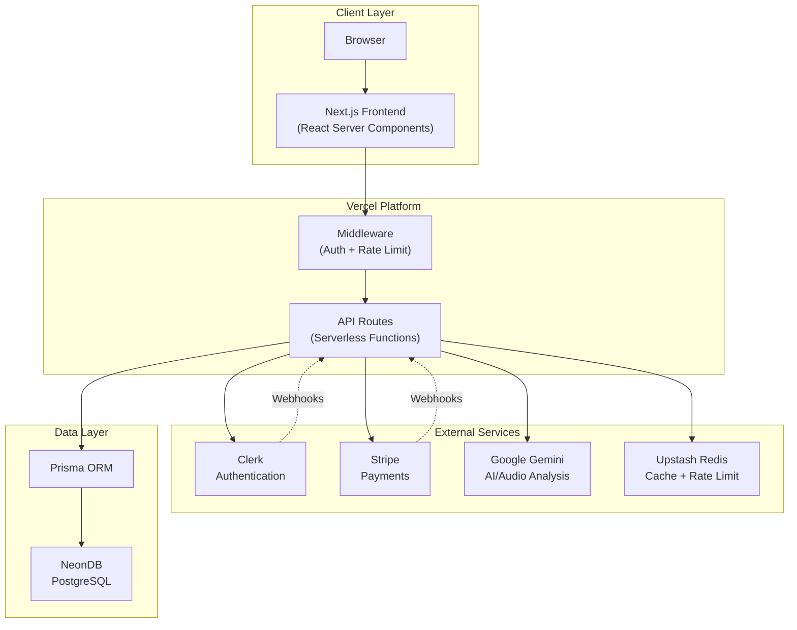
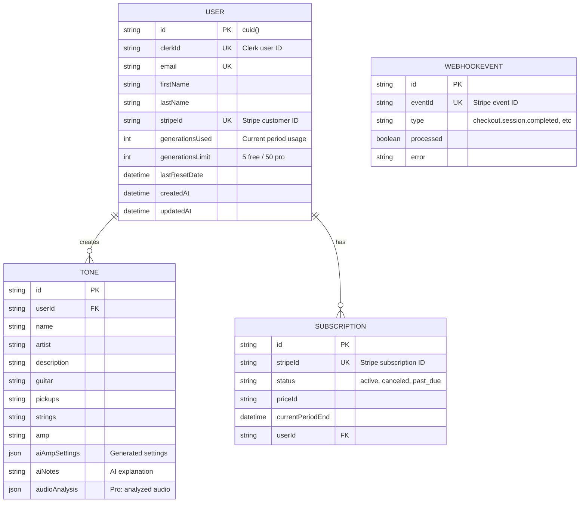
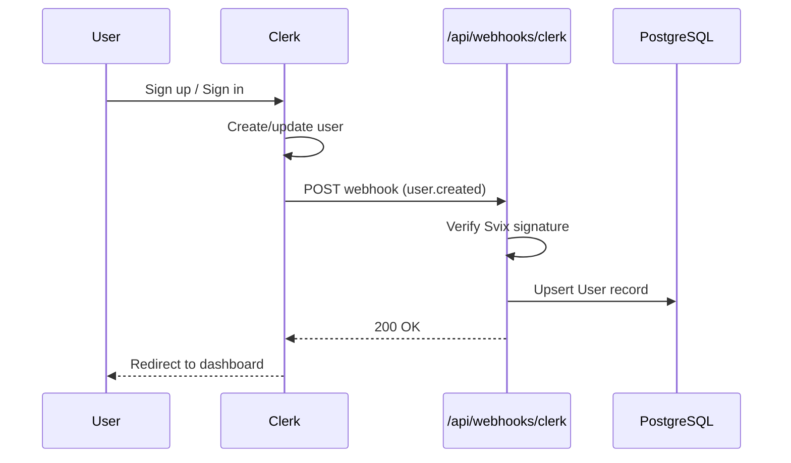
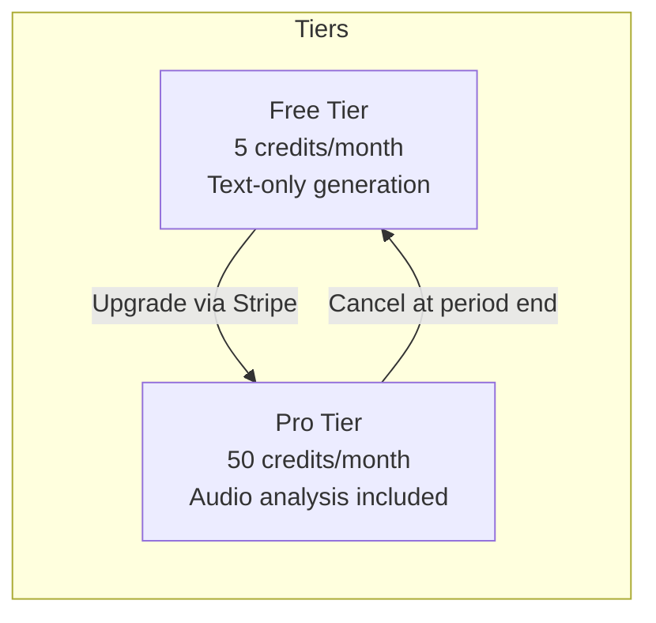
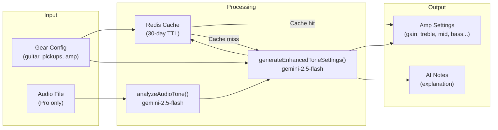
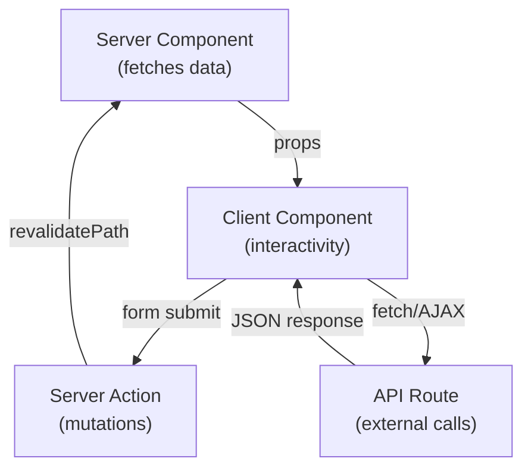

# Tono - Architecture Documentation

> **AI-Powered Guitar Tone Engine** | Next.js 15 + TypeScript + Prisma + Clerk + Stripe + Gemini

---

## Table of Contents

1. [System Architecture](#1-system-architecture)
2. [Database Design](#2-database-design)
3. [API Design](#3-api-design)
4. [Authentication](#4-authentication)
5. [Payments](#5-payments)
6. [AI Integration](#6-ai-integration)
7. [Caching & Rate Limiting](#7-caching--rate-limiting)
8. [Frontend Architecture](#8-frontend-architecture)
9. [Testing Strategy](#9-testing-strategy)
10. [Interview Talking Points](#10-interview-talking-points)

---

## 1. System Architecture

### High-Level Diagram



### Design Decisions

| Decision       | Choice                  | Rationale                                                     |
| -------------- | ----------------------- | ------------------------------------------------------------- |
| **Framework**  | Next.js 15 (App Router) | RSC for performance, built-in API routes, Vercel optimization |
| **Database**   | PostgreSQL (NeonDB)     | Relational data, ACID compliance, Prisma support              |
| **Auth**       | Clerk                   | Zero-config, webhooks for DB sync, production-ready           |
| **Payments**   | Stripe                  | Industry standard, subscription support, webhook reliability  |
| **AI**         | Google Gemini           | Multimodal (text + audio), cost-effective, fast               |
| **Cache**      | Upstash Redis           | Serverless-compatible, global edge, built-in rate limiting    |
| **Deployment** | Vercel                  | Zero-config Next.js, edge functions, automatic HTTPS          |

---

## 2. Database Design

### ER Diagram



### Schema Patterns

| Pattern             | Implementation                       | Purpose                                        |
| ------------------- | ------------------------------------ | ---------------------------------------------- |
| **Soft References** | `clerkId`, `stripeId` fields         | Link to external services without foreign keys |
| **Credit System**   | `generationsUsed`/`generationsLimit` | Usage-based billing with tier limits           |
| **Idempotency**     | `WebhookEvent.eventId` unique        | Prevent duplicate webhook processing           |
| **JSON Storage**    | `aiAmpSettings`, `audioAnalysis`     | Flexible AI output storage                     |
| **Indexed Queries** | `@@index([userId, createdAt])`       | Fast paginated tone queries                    |

---

## 3. API Design

### Endpoints Reference

| Route                  | Method         | Auth       | Purpose                        | Rate Limit |
| ---------------------- | -------------- | ---------- | ------------------------------ | ---------- |
| `/api/tones`           | POST           | Clerk      | Create tone with AI generation | 10/min     |
| `/api/tones`           | GET            | Clerk      | List user's tones (paginated)  | 100/min    |
| `/api/tones/[id]`      | GET/PUT/DELETE | Clerk      | Individual tone operations     | 100/min    |
| `/api/tones/guest`     | POST           | None       | Demo generation (limited)      | 5/min      |
| `/api/webhooks/clerk`  | POST           | Svix       | User sync events               | None       |
| `/api/webhooks/stripe` | POST           | Stripe sig | Payment events                 | None       |
| `/api/stripe/checkout` | POST           | Clerk      | Create checkout session        | 5/hr       |
| `/api/stripe/portal`   | POST           | Clerk      | Billing portal URL             | 10/hr      |

### Request/Response Format

**POST /api/tones** (multipart/form-data)

```typescript
// Request
{
  name: string;          // Required
  artist: string;        // Required
  description: string;   // Required
  guitar: string;        // Required
  pickups: string;       // Required
  strings?: string;
  amp: string;           // Required
  audioFile?: File;      // Pro only: audio for analysis
}

// Success Response (201)
{
  message: "Successfully created tone",
  tone: {
    id: string;
    aiAmpSettings: {
      gain: number;    // 0-10, 0.5 increments
      treble: number;
      mid: number;
      bass: number;
      volume: number;
      presence: number;
      reverb: number;
    };
    aiNotes: string;
    audioAnalysis?: AudioToneCharacteristics;
  }
}
```

### Error Handling

```typescript
// lib/api/errorHandler.ts
class APIError extends Error {
  constructor(
    message: string,
    public statusCode: number, // HTTP status
    public code: string, // Machine-readable code
    public parsedError?: ZodIssue[] // Validation details
  ) {}
}

// Standard error codes
UNAUTHORIZED; // 401 - No valid session
USER_NOT_FOUND; // 404 - User not in DB
VALIDATION_ERROR; // 400 - Invalid input
RATE_LIMIT_EXCEEDED; // 429 - Too many requests
CREDITS_EXHAUSTED; // 403 - No remaining credits
FEATURE_NOT_AVAILABLE; // 403 - Pro feature on free tier
```

---

## 4. Authentication

### Clerk Integration Flow



### Webhook Handler

```typescript
// app/api/webhooks/clerk/route.ts
export async function POST(req: Request) {
  // 1. Validate Svix headers
  const svixHeaders = {
    'svix-id': headers.get('svix-id'),
    'svix-timestamp': headers.get('svix-timestamp'),
    'svix-signature': headers.get('svix-signature'),
  };

  // 2. Verify webhook signature
  const webhook = new Webhook(CLERK_WEBHOOK_SECRET);
  const event = webhook.verify(payload, svixHeaders);

  // 3. Handle event types
  switch (event.type) {
    case 'user.created':
    case 'user.updated':
      await prisma.user.upsert({
        where: { clerkId: data.id },
        create: { clerkId, email, firstName, lastName },
        update: { email, firstName, lastName },
      });
      break;
    case 'user.deleted':
      await prisma.user.delete({ where: { clerkId } });
      break;
  }
}
```

### Protected Routes

- Clerk Middleware protects `/dashboard/*` routes
- API routes use `currentUser()` from `@clerk/nextjs/server`
- Webhooks use signature verification (no Clerk session)

---

## 5. Payments

### Subscription Model



### Credit System

```typescript
// lib/config.ts
export const FREE_CREDIT_LIMIT = 5;
export const PRO_CREDIT_LIMIT = 50;

// Usage check in /api/tones POST
await prisma.$transaction(async (tx) => {
  const user = await tx.user.findUnique({
    where: { id: dbUser.id },
    select: { generationsUsed: true, generationsLimit: true },
  });

  if (user.generationsUsed >= user.generationsLimit) {
    throw new APIError('No remaining credits', 403, 'CREDITS_EXHAUSTED');
  }

  // Reserve credit atomically
  await tx.user.update({
    where: { id: dbUser.id },
    data: { generationsUsed: { increment: 1 } },
  });
});
```

### Stripe Webhook Events

| Event                           | Action                       |
| ------------------------------- | ---------------------------- |
| `checkout.session.completed`    | Upgrade user to Pro limits   |
| `customer.subscription.updated` | Sync subscription status     |
| `customer.subscription.deleted` | Downgrade to Free limits     |
| `invoice.payment_failed`        | Mark subscription `past_due` |

### Idempotency Protection

```typescript
// Prevent duplicate webhook processing
const existingEvent = await prisma.webhookEvent.findUnique({
  where: { eventId: event.id },
});

if (existingEvent) {
  return NextResponse.json({ received: true }); // Already processed
}

// Record event before processing
await prisma.webhookEvent.create({
  data: { eventId: event.id, type: event.type, processed: false },
});
```

---

## 6. AI Integration

### Gemini API Pipeline



### Prompt Engineering

**System Prompt (Text-Only)**

```
You are a guitar tone engineer. Provide SPECIFIC amp settings for the given gear.

REQUIREMENTS:
1. Analyze full gear: guitar, pickups (single-coil vs humbucker), strings, amp type
2. Match tone description: bright/dark, compressed/dynamic, clean/overdriven
3. Adjust for amp characteristics (British/American, tube/solid-state)
4. Humbuckers need less gain; single-coils may need mid boost
5. Base on artist's documented settings when possible, adapt to provided gear
```

**Enhanced Prompt (With Audio Analysis)**

```
Audio Analysis Results:
- Brightness: ${brightness}
- Distortion Level: ${distortion}
- Frequency Balance: Bass=${bass}, Mids=${mids}, Treble=${treble}
- Effects Detected: ${effects.join(', ')}
- Dynamics: ${dynamics}

Provide exact settings that will recreate this analyzed tone using the specified gear.
```

### Resilience Patterns

```typescript
// lib/gemini/gemini.ts
export async function retryGeminiRequest<T>(
  operation: () => Promise<T>,
  maxRetries = 3,
  initialDelay = 1000
): Promise<T> {
  for (let attempt = 0; attempt <= maxRetries; attempt++) {
    try {
      return await operation();
    } catch (error) {
      const isOverloaded = error.status === 503 || error.status === 429;

      if (attempt < maxRetries && isOverloaded) {
        const delay = initialDelay * Math.pow(2, attempt); // 1s, 2s, 4s
        await new Promise((r) => setTimeout(r, delay));
        continue;
      }
      throw error;
    }
  }
}
```

---

## 7. Caching & Rate Limiting

### Redis Strategy (Upstash)

| Cache Type     | Key Pattern               | TTL            | Purpose                  |
| -------------- | ------------------------- | -------------- | ------------------------ |
| **Tone Cache** | `tone:v1:{sha256}`        | 30 days        | Avoid duplicate AI calls |
| **Rate Limit** | `ratelimit:tone:{userId}` | Sliding window | Prevent abuse            |

### Tone Caching Implementation

```typescript
// lib/gemini/toneCache.ts
function generateCacheKey(config: ToneGearConfig): string {
  // Normalize inputs for consistent caching
  const normalized = {
    artist: config.artist.toLowerCase().trim(),
    description: config.description.toLowerCase().trim(),
    guitar: config.guitar.toLowerCase().trim(),
    // ... other fields
  };

  // SHA-256 hash for collision resistance
  const hash = createHash('sha256').update(JSON.stringify(normalized)).digest('hex');

  return `tone:v1:${hash}`;
}

export async function getCachedTone(config): Promise<AIToneResult | null> {
  const cached = await redis.get(generateCacheKey(config));
  return cached || null;
}

export async function setCachedTone(config, result): Promise<void> {
  await redis.set(generateCacheKey(config), result, { ex: CACHE_TTL });
}
```

### Rate Limiting Tiers

```typescript
// lib/rateLimit.ts
// AI generation - expensive operation
export const toneRateLimit = new Ratelimit({
  redis: Redis.fromEnv(),
  limiter: Ratelimit.slidingWindow(10, '1 m'),
  prefix: 'ratelimit:tone',
});

// Checkout - prevent abuse
export const checkoutRateLimit = new Ratelimit({
  limiter: Ratelimit.slidingWindow(5, '1 h'),
  prefix: 'ratelimit:checkout',
});

// General API - lighter limit
export const apiRateLimit = new Ratelimit({
  limiter: Ratelimit.slidingWindow(100, '1 m'),
  prefix: 'ratelimit:api',
});
```

---

## 8. Frontend Architecture

### Component Organization

```
components/
├── home/                    # Landing page components
│   ├── Hero.tsx            # Hero section with CTA
│   ├── Features.tsx        # Feature grid
│   ├── Pricing.tsx         # Pricing cards (Free/Pro)
│   ├── GetStarted.tsx      # Auth CTA
│   └── GuestToneForm.tsx   # Demo form (no auth)
│
├── dashboard/               # Authenticated area
│   ├── Header.tsx          # Top nav with user menu
│   ├── Sidebar.tsx         # Navigation sidebar
│   ├── ToneConfigurationForm.tsx  # Main form
│   ├── SignalChainVisualization.tsx # Amp settings display
│   └── ManageSubscriptionButton.tsx
│
└── ui/                      # Reusable primitives (shadcn/ui)
    ├── button.tsx
    ├── card.tsx
    ├── input.tsx
    └── ...
```

### Data Flow Pattern



### Key Design Patterns

| Pattern               | Implementation                          |
| --------------------- | --------------------------------------- |
| **Server Components** | Default for pages, data fetching        |
| **Client Components** | Forms, interactivity (`'use client'`)   |
| **Server Actions**    | Form submissions, revalidation          |
| **API Routes**        | External service calls (Gemini, Stripe) |
| **Route Groups**      | `(home)` for public, `(app)` for auth   |

---

## 9. Testing Strategy

### Test Structure

```
__tests__/
├── app/           # Route/page tests
├── component/     # React component tests
└── unit/          # Pure function tests

tests/             # Playwright E2E
├── auth.setup.ts  # Global auth setup
└── *.spec.ts      # E2E scenarios
```

### Jest Configuration

```typescript
// jest.config.ts
const customJestConfig: Config = {
  setupFilesAfterEnv: ['<rootDir>/jest.setup.ts'],
  testEnvironment: 'jest-environment-jsdom',
  moduleNameMapper: {
    '^@/(.*)$': '<rootDir>/$1', // Path aliases
  },
  testPathIgnorePatterns: ['/tests/'], // Exclude Playwright
};
```

### Playwright Configuration

```typescript
// playwright.config.ts
export default defineConfig({
  testDir: './tests',
  globalSetup: require.resolve('./tests/auth.setup.ts'),

  projects: [
    { name: 'chromium', use: { ...devices['Desktop Chrome'] } },
    { name: 'firefox', use: { ...devices['Desktop Firefox'] } },
    { name: 'webkit', use: { ...devices['Desktop Safari'] } },
  ],

  webServer: {
    command: 'npm run dev',
    url: 'http://localhost:3000',
    reuseExistingServer: !process.env.CI,
  },
});
```

### Test Commands

```bash
npm test              # Jest unit/component tests
npx playwright test   # E2E tests
npm run test:ci       # All tests (CI pipeline)
```

---

## 10. Interview Talking Points

### System Design Questions

**Q: How do you handle user authentication?**

> We use Clerk for authentication with webhook-based database sync. When a user signs up, Clerk sends a webhook to `/api/webhooks/clerk`, which we verify using Svix signatures, then upsert the user in our PostgreSQL database. This ensures our database stays in sync without blocking the signup flow.

**Q: How do you prevent duplicate webhook processing?**

> We use an idempotency pattern with a `WebhookEvent` table. Before processing any Stripe webhook, we check if the `eventId` already exists. If so, we return 200 immediately. Otherwise, we create the record first, then process. This handles network retries gracefully.

**Q: How does your credit system work?**

> Users have `generationsUsed` and `generationsLimit` fields. Free tier gets 5 credits/month, Pro gets 50. We use a Prisma transaction to atomically check and reserve credits before AI generation. Stripe webhooks automatically adjust limits on subscription changes.

### Database Questions

**Q: Why store AI results as JSON?**

> The `aiAmpSettings` structure is consistent but may evolve. JSON gives us flexibility to add new settings (like effects parameters) without migrations. We validate the structure in TypeScript, so we get type safety despite flexible storage.

**Q: How do you optimize tone queries?**

> We have a composite index `@@index([userId, createdAt])` for the common query pattern of "get user's tones, newest first". Pagination uses cursor-based skip/take with the same index.

### AI Integration Questions

**Q: How do you make AI calls reliable?**

> Three patterns: (1) Redis caching with SHA-256 keys and 30-day TTL to avoid duplicate calls, (2) Exponential backoff retry (1s, 2s, 4s) for 503/429 errors, (3) Graceful fallback to default settings if all retries fail.

**Q: Explain your prompt engineering approach.**

> We use structured prompts with explicit JSON schema in the system prompt. For audio-enhanced generation, we inject analyzed tone characteristics directly into the prompt. We set `responseMimeType: 'application/json'` to get reliable structured output.

### Performance Questions

**Q: How do you handle rate limiting?**

> Upstash Redis with sliding window algorithm. Different limits per operation: 10 AI generations/minute, 5 checkouts/hour, 100 reads/minute. Each prefix is isolated, so hitting tone limit doesn't block reads.

**Q: How do you optimize the frontend?**

> React Server Components by default, so most pages stream from the server with zero JS. Interactive components are marked `'use client'`. We use route groups to separate public (cached) and authenticated (dynamic) content.

### Code Examples to Reference

| Topic                | File                                    |
| -------------------- | --------------------------------------- |
| Webhook idempotency  | `app/api/webhooks/stripe/route.ts`      |
| Transaction pattern  | `app/api/tones/route.ts` (credit check) |
| Retry with backoff   | `lib/gemini/gemini.ts`                  |
| Cache key generation | `lib/gemini/toneCache.ts`               |
| Rate limit setup     | `lib/rateLimit.ts`                      |
| Error handling       | `lib/api/errorHandler.ts`               |
