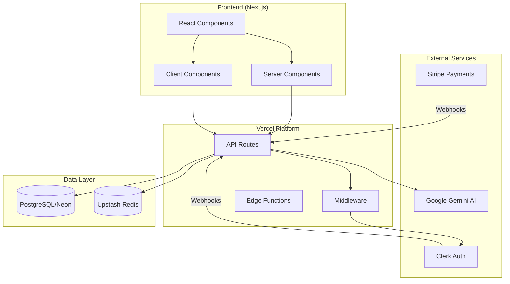
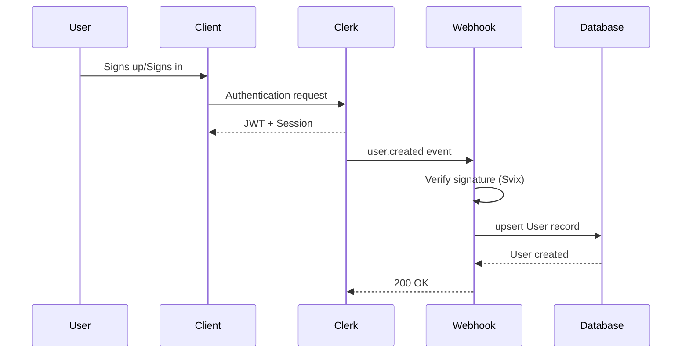

# 🎸 tono - Full Stack Interview Study Guide

> **A comprehensive reference document for reviewing your portfolio project in preparation for Full Stack Software Developer interviews.**

---

## 📋 Table of Contents

1. [Project Overview](#-project-overview)
2. [Architecture & System Design](#-architecture--system-design)
3. [Tech Stack Deep Dive](#-tech-stack-deep-dive)
4. [Database Design](#-database-design)
5. [API Design & Backend Patterns](#-api-design--backend-patterns)
6. [Authentication & Authorization](#-authentication--authorization)
7. [Third-Party Integrations](#-third-party-integrations)
8. [Frontend Patterns](#-frontend-patterns)
9. [Testing Strategy](#-testing-strategy)
10. [DevOps & Deployment](#-devops--deployment)
11. [Practice Interview Questions](#-practice-interview-questions)
12. [Code Snippets Reference](#-code-snippets-reference)

---

## 🎯 Project Overview

**tono** is a full-stack AI-powered SaaS application that helps guitarists achieve their desired sound. Users input their guitar/amp setup and a creative goal, and the app delivers precise amp settings using Google Gemini AI.

### Key Features

- 🤖 **AI Tone Generation** - Google Gemini translates descriptions into amp settings
- 💾 **Persistent Configurations** - Save and manage tone presets
- 🔐 **Secure Authentication** - Clerk-powered auth with webhook sync
- 💳 **Subscription Billing** - Stripe integration with webhooks
- ⚡ **Rate Limiting** - Upstash Redis for API protection
- 🔄 **Caching** - Upstash Redis for AI response caching

### Live Demo

- **URL**: [https://tono-ruby.vercel.app](https://tono-ruby.vercel.app)
- **Repo**: [https://github.com/ericmignardi/tono](https://github.com/ericmignardi/tono)

---

## 🏗 Architecture & System Design

### High-Level Architecture Diagram



### Key Architectural Decisions

| Decision  | Choice                | Why                                                    |
| --------- | --------------------- | ------------------------------------------------------ |
| Framework | Next.js 16 App Router | Server components, edge rendering, built-in API routes |
| Database  | PostgreSQL (Neon)     | Serverless-friendly, scales to zero, branching support |
| ORM       | Prisma                | Type-safe queries, migrations, schema as code          |
| Auth      | Clerk                 | Pre-built components, webhook sync, minimal code       |
| Payments  | Stripe                | Industry standard, robust webhook system               |
| AI        | Google Gemini         | Cost-effective, JSON response mode, multimodal support |
| Caching   | Upstash Redis         | Serverless Redis, rate limiting & AI response caching  |

### Interview Talking Points

> _"I chose Next.js App Router for its Server Component architecture, which allows me to fetch data on the server and reduce client-side JavaScript. The serverless architecture on Vercel means I only pay for what I use, and Neon's serverless PostgreSQL scales to zero when not in use."_

> _"For state management, I rely primarily on React Server Components for server state, with minimal client state using React's built-in useState. Form state is managed by React Hook Form with Zod validation."_

---

## 🛠 Tech Stack Deep Dive

### Frontend Stack

| Technology          | Purpose           | File Reference                                                         |
| ------------------- | ----------------- | ---------------------------------------------------------------------- |
| **Next.js 16**      | React framework   | [next.config.ts](file:///c:/Users/migna/Documents/tono/next.config.ts) |
| **TypeScript**      | Type safety       | [tsconfig.json](file:///c:/Users/migna/Documents/tono/tsconfig.json)   |
| **Tailwind CSS 4**  | Styling           | [globals.css](file:///c:/Users/migna/Documents/tono/app/globals.css)   |
| **Shadcn/UI**       | Component library | [components/ui/](file:///c:/Users/migna/Documents/tono/components/ui)  |
| **React Hook Form** | Form management   | [package.json](file:///c:/Users/migna/Documents/tono/package.json)     |
| **Zod**             | Schema validation | Integrated with RHF                                                    |
| **Framer Motion**   | Animations        | `motion` package                                                       |

### Backend Stack

| Technology        | Purpose               | File Reference                                                                        |
| ----------------- | --------------------- | ------------------------------------------------------------------------------------- |
| **Prisma 6**      | ORM                   | [schema.prisma](file:///c:/Users/migna/Documents/tono/prisma/schema.prisma)           |
| **PostgreSQL**    | Database              | Neon serverless                                                                       |
| **Clerk**         | Authentication        | [route.ts](file:///c:/Users/migna/Documents/tono/app/api/webhooks/clerk/route.ts)     |
| **Stripe**        | Payments              | [route.ts](file:///c:/Users/migna/Documents/tono/app/api/webhooks/stripe/route.ts)    |
| **Google Gemini** | AI                    | [toneAiService.ts](file:///c:/Users/migna/Documents/tono/lib/gemini/toneAiService.ts) |
| **Upstash**       | Rate limiting & cache | [rateLimit.ts](file:///c:/Users/migna/Documents/tono/lib/rateLimit.ts)                |

---

## 💾 Database Design

### Schema Overview

```prisma
// Core Models from schema.prisma

model User {
  id               String          @id @default(cuid())
  clerkId          String          @unique    // Clerk integration
  email            String          @unique
  firstName        String?
  lastName         String?
  stripeId         String?         @unique    // Stripe integration
  generationsUsed  Int             @default(0)
  generationsLimit Int             @default(5)
  lastResetDate    DateTime?       @default(now())
  createdAt        DateTime        @default(now())
  updatedAt        DateTime        @updatedAt
  tones            Tone[]
  subscriptions    Subscription[]
}

model Subscription {
  id                String   @id @default(cuid())
  stripeId          String   @unique
  status            String   // active, canceled, etc.
  priceId           String
  currentPeriodEnd  DateTime?
  user              User     @relation(fields: [userId], references: [id])
  userId            String
  createdAt         DateTime @default(now())
  updatedAt         DateTime @updatedAt
}

model Tone {
  id            String   @id @default(cuid())
  user          User     @relation(fields: [userId], references: [id])
  userId        String
  name          String
  artist        String
  description   String
  guitar        String
  pickups       String
  strings       String?
  amp           String
  aiAmpSettings Json     // Stores AI-generated settings
  aiNotes       String
  audioAnalysis Json?    // Optional audio analysis data
  createdAt     DateTime @default(now())
  updatedAt     DateTime @updatedAt
  @@index([userId, createdAt])  // Composite index for queries
}

model WebhookEvent {
  id        String   @id @default(cuid())
  eventId   String   @unique    // Idempotency key
  type      String
  processed Boolean  @default(false)
  error     String?
  createdAt DateTime @default(now())
  @@index([eventId])
  @@index([processed])
  @@index([createdAt])
}
```

### Database Design Concepts to Discuss

1. **Relationships**
   - One-to-Many: `User` → `Tone[]` (user has many tones)
   - One-to-Many: `User` → `Subscription[]` (user can have subscription history)

2. **Indexes**
   - Composite index on `[userId, createdAt]` for paginated tone queries
   - Unique constraints on external IDs (`clerkId`, `stripeId`, `eventId`)

3. **JSON Fields**
   - `aiAmpSettings` stores structured AI output (flexible schema)
   - `audioAnalysis` optional multimodal AI analysis

4. **Soft Deletes vs Hard Deletes**
   - Currently using hard deletes with cascade
   - Could discuss trade-offs of soft delete pattern

### Interview Sample Questions

> **Q: "Why did you choose to store amp settings as JSON instead of separate columns?"**
>
> A: "The AI can return varying numbers of settings, and JSON allows flexibility. For read-heavy queries where I don't filter by individual settings, this works well. If I needed to query 'find all tones with gain > 7', I'd normalize into a separate table or use PostgreSQL JSONB operators."

> **Q: "Explain your indexing strategy."**
>
> A: "The composite index on `[userId, createdAt]` optimizes the most common query pattern: fetching a user's tones in chronological order with pagination. The unique constraints on external IDs prevent duplicate records from webhooks being processed twice."

---

## 🔌 API Design & Backend Patterns

### API Route Structure

```
app/api/
├── stripe/           # Stripe checkout/portal
├── tones/           # CRUD for tones
│   ├── route.ts     # GET (list), POST (create)
│   ├── [id]/        # GET, PATCH, DELETE by ID
│   └── guest/       # Guest tone generation
├── user/            # User management
└── webhooks/
    ├── clerk/       # Clerk user sync
    └── stripe/      # Stripe subscription sync
```

### API Route Pattern (from `/api/tones/route.ts`)

```typescript
import { NextRequest, NextResponse } from 'next/server';
import { prisma } from '@/lib/prisma/database';
import { currentUser } from '@clerk/nextjs/server';
import { toneRateLimit, apiRateLimit } from '@/lib/rateLimit';
import { APIError, handleAPIError, logRequest } from '@/lib/api/errorHandler';
import { randomUUID } from 'crypto';

export const maxDuration = 60; // Vercel timeout

export async function POST(req: NextRequest) {
  const requestId = randomUUID();

  try {
    // 1. Authentication
    const user = await currentUser();
    if (!user) {
      throw new APIError('Unauthorized', 401, 'UNAUTHORIZED');
    }

    // 2. Request logging
    logRequest({
      requestId,
      method: 'POST',
      path: '/api/tones',
      userId: user.id,
    });

    // 3. Rate limiting
    const { success } = await toneRateLimit.limit(user.id);
    if (!success) {
      throw new APIError(
        'Too many tone generation requests. Please slow down.',
        429,
        'RATE_LIMIT_EXCEEDED'
      );
    }

    // 4. Database lookup
    const dbUser = await prisma.user.findUnique({
      where: { clerkId: user.id },
      include: { subscriptions: true },
    });

    if (!dbUser) {
      throw new APIError('User not found', 404, 'USER_NOT_FOUND');
    }

    // 5. Business logic with transaction
    await prisma.$transaction(async (tx) => {
      const freshUser = await tx.user.findUnique({
        where: { id: dbUser.id },
        select: { generationsUsed: true, generationsLimit: true },
      });

      if (!freshUser || freshUser.generationsUsed >= freshUser.generationsLimit) {
        throw new APIError(
          'No remaining credits. Please upgrade your plan.',
          403,
          'CREDITS_EXHAUSTED'
        );
      }

      // Reserve the credit atomically
      await tx.user.update({
        where: { id: dbUser.id },
        data: { generationsUsed: { increment: 1 } },
      });
    });

    // 6. External API call (AI)
    const aiResult = await generateEnhancedToneSettings(config);

    // 7. Create resource
    const tone = await prisma.tone.create({
      data: {
        /* ... */
      },
    });

    // 8. Cache invalidation
    revalidatePath('/dashboard/tones');

    return NextResponse.json({ tone }, { status: 201 });
  } catch (error) {
    return handleAPIError(error, requestId);
  }
}
```

### Custom Error Handler Pattern

```typescript
// lib/api/errorHandler.ts

export class APIError extends Error {
  constructor(
    message: string,
    public statusCode: number,
    public code: string,
    public parsedError?: $ZodIssue[]
  ) {
    super(message);
    this.name = 'APIError';
  }
}

export function handleAPIError(error: unknown, requestId?: string) {
  if (error instanceof APIError) {
    return NextResponse.json(
      {
        error: error.message,
        code: error.code,
        ...(requestId && { requestId }),
      },
      { status: error.statusCode }
    );
  }

  // Unexpected errors - don't expose details in production
  return NextResponse.json(
    {
      error: 'Internal server error',
      code: 'INTERNAL_ERROR',
      ...(process.env.NODE_ENV === 'development' && {
        details: error instanceof Error ? error.message : 'Unknown error',
      }),
    },
    { status: 500 }
  );
}
```

### Rate Limiting Implementation

```typescript
// lib/rateLimit.ts

import { Ratelimit } from '@upstash/ratelimit';
import { Redis } from '@upstash/redis';

// Different limits for different operations
export const toneRateLimit = new Ratelimit({
  redis: Redis.fromEnv(),
  limiter: Ratelimit.slidingWindow(10, '1 m'), // 10 per minute
  analytics: true,
  prefix: 'ratelimit:tone',
});

export const checkoutRateLimit = new Ratelimit({
  redis: Redis.fromEnv(),
  limiter: Ratelimit.slidingWindow(5, '1 h'), // 5 per hour
  analytics: true,
  prefix: 'ratelimit:checkout',
});

export const apiRateLimit = new Ratelimit({
  redis: Redis.fromEnv(),
  limiter: Ratelimit.slidingWindow(100, '1 m'), // 100 per minute (reads)
  analytics: true,
  prefix: 'ratelimit:api',
});
```

---

## 🔐 Authentication & Authorization

### Clerk Integration Architecture



### Clerk Webhook Handler

```typescript
// app/api/webhooks/clerk/route.ts

import { Webhook } from 'svix';
import { headers } from 'next/headers';
import type { WebhookEvent } from '@clerk/nextjs/server';
import { prisma } from '@/lib/prisma/database';

export async function POST(req: Request) {
  // 1. Validate webhook secret exists
  if (!config.CLERK_WEBHOOK_SECRET) {
    return new NextResponse('Webhook secret missing', { status: 500 });
  }

  // 2. Extract Svix headers for verification
  const headerList = await headers();
  const svixHeaders = {
    'svix-id': headerList.get('svix-id') ?? '',
    'svix-timestamp': headerList.get('svix-timestamp') ?? '',
    'svix-signature': headerList.get('svix-signature') ?? '',
  };

  // 3. Verify signature
  const payload = await req.text();
  const webhook = new Webhook(config.CLERK_WEBHOOK_SECRET);
  let event: WebhookEvent;

  try {
    event = webhook.verify(payload, svixHeaders) as WebhookEvent;
  } catch (err) {
    return new NextResponse('Invalid signature', { status: 400 });
  }

  // 4. Handle event types
  switch (event.type) {
    case 'user.created':
      await prisma.user.upsert({
        where: { clerkId: data.id },
        update: { email, firstName, lastName },
        create: { clerkId: data.id, email, firstName, lastName },
      });
      break;

    case 'user.updated':
      // Handle updates...
      break;

    case 'user.deleted':
      // Handle deletion with existence check...
      break;
  }

  return NextResponse.json({ success: true });
}
```

### Protected Layout Pattern

```typescript
// app/(app)/dashboard/layout.tsx

import { auth } from "@clerk/nextjs/server";
import { redirect } from "next/navigation";

export default async function DashboardLayout({
  children,
}: {
  children: React.ReactNode;
}) {
  // Server-side auth check
  const { userId } = await auth();

  if (!userId) {
    redirect("/sign-in");
  }

  return (
    <div className="flex h-screen">
      <Sidebar />
      <main className="flex-1">
        <Header />
        {children}
      </main>
    </div>
  );
}
```

---

## 🔗 Third-Party Integrations

### Stripe Webhook Handler (with Idempotency)

```typescript
// app/api/webhooks/stripe/route.ts

export async function POST(req: NextRequest) {
  const body = await req.text();
  const signature = req.headers.get('stripe-signature');

  // 1. Verify webhook signature
  let event: Stripe.Event;
  try {
    event = stripe.webhooks.constructEvent(body, signature!, config.STRIPE_WEBHOOK_SECRET);
  } catch (err) {
    return new NextResponse('Invalid signature', { status: 400 });
  }

  try {
    // 2. Check for duplicate events (IDEMPOTENCY)
    const existingEvent = await prisma.webhookEvent.findUnique({
      where: { eventId: event.id },
    });

    if (existingEvent) {
      console.log(`Duplicate event ${event.id}, skipping`);
      return NextResponse.json({ received: true });
    }

    // 3. Record event BEFORE processing
    await prisma.webhookEvent.create({
      data: {
        eventId: event.id,
        type: event.type,
        processed: false,
      },
    });

    // 4. Handle event types
    switch (event.type) {
      case 'checkout.session.completed':
        // Handle subscription creation
        break;
      case 'customer.subscription.updated':
        // Handle subscription changes
        break;
      case 'customer.subscription.deleted':
        // Downgrade user to free tier
        await prisma.user.update({
          where: { id: user.id },
          data: { generationsLimit: FREE_CREDIT_LIMIT },
        });
        break;
      case 'invoice.payment_failed':
        // Mark subscription as past_due
        break;
    }

    // 5. Mark event as processed
    await prisma.webhookEvent.update({
      where: { eventId: event.id },
      data: { processed: true },
    });

    return NextResponse.json({ received: true });
  } catch (error) {
    // 6. Record error for debugging
    await prisma.webhookEvent.update({
      where: { eventId: event.id },
      data: { processed: false, error: error.message },
    });
    return NextResponse.json({ error: 'Handler failed' }, { status: 500 });
  }
}
```

### Google Gemini AI Integration

```typescript
// lib/gemini/gemini.ts

import { GoogleGenerativeAI } from '@google/generative-ai';

export const genAI = new GoogleGenerativeAI(process.env.GEMINI_API_KEY!);

export function getModel(modelName: string = 'gemini-2.5-flash') {
  return genAI.getGenerativeModel({ model: modelName });
}

// Retry with exponential backoff
export async function retryGeminiRequest<T>(
  operation: () => Promise<T>,
  maxRetries: number = 3,
  initialDelay: number = 1000
): Promise<T> {
  let lastError: any;

  for (let attempt = 0; attempt <= maxRetries; attempt++) {
    try {
      return await operation();
    } catch (error: any) {
      lastError = error;

      const isOverloaded =
        error.status === 503 || error.status === 429 || error.message?.includes('overloaded');

      if (attempt < maxRetries && isOverloaded) {
        const delay = initialDelay * Math.pow(2, attempt); // 1s, 2s, 4s
        console.warn(`Retrying in ${delay}ms (Attempt ${attempt + 1})`);
        await new Promise((resolve) => setTimeout(resolve, delay));
        continue;
      }
      throw error;
    }
  }
  throw lastError;
}
```

### AI Tone Generation Service

```typescript
// lib/gemini/toneAiService.ts

const SYSTEM_PROMPT = `You are a guitar tone engineer. 
Provide SPECIFIC amp settings for the given gear.

Output ONLY valid JSON:
{
  "ampSettings": {
    "gain": number (0-10),
    "treble": number (0-10),
    "mid": number (0-10),
    "bass": number (0-10),
    "volume": number (0-10),
    "presence": number (0-10),
    "reverb": number (0-10)
  },
  "notes": string (2-3 sentences on WHY these settings work)
}`;

export async function generateToneSettings(
  config: ToneGearConfig,
  bypassCache = false
): Promise<AIToneResult> {
  // 1. Check cache first
  if (!bypassCache) {
    const cachedResult = await getCachedTone(config);
    if (cachedResult) return cachedResult;
  }

  // 2. Call Gemini API with retry logic
  const model = getModel('gemini-2.5-flash');

  const result = await retryGeminiRequest(() =>
    model.generateContent({
      contents: [
        {
          role: 'user',
          parts: [{ text: SYSTEM_PROMPT }, { text: buildUserPrompt(config) }],
        },
      ],
      generationConfig: {
        temperature: 0.3, // Low temp for consistent output
        responseMimeType: 'application/json', // Force JSON output
      },
    })
  );

  // 3. Parse and cache result
  const parsed = JSON.parse(result.response.text());
  await setCachedTone(config, parsed);

  return parsed;
}
```

### Caching Layer

```typescript
// lib/gemini/toneCache.ts

import { Redis } from '@upstash/redis';
import { createHash } from 'crypto';

const redis = Redis.fromEnv();
const CACHE_TTL = 60 * 60 * 24 * 30; // 30 days

// Deterministic cache key from config
function generateCacheKey(config: ToneGearConfig): string {
  const normalizedConfig = {
    artist: config.artist.toLowerCase().trim(),
    description: config.description.toLowerCase().trim(),
    // ... normalize all fields
  };

  const hash = createHash('sha256').update(JSON.stringify(normalizedConfig)).digest('hex');

  return `tone:v1:${hash}`;
}

export async function getCachedTone(config: ToneGearConfig): Promise<AIToneResult | null> {
  try {
    const cacheKey = generateCacheKey(config);
    return await redis.get<AIToneResult>(cacheKey);
  } catch (error) {
    // Fail gracefully - don't block on cache errors
    return null;
  }
}

export async function setCachedTone(config: ToneGearConfig, result: AIToneResult): Promise<void> {
  try {
    const cacheKey = generateCacheKey(config);
    await redis.set(cacheKey, result, { ex: CACHE_TTL });
  } catch (error) {
    // Fail gracefully
    console.error('Cache set failed:', error);
  }
}
```

---

## ⚛️ Frontend Patterns

### Root Layout with Providers

```typescript
// app/layout.tsx

import { ClerkProvider } from "@clerk/nextjs";
import { Providers } from "./providers";
import { Toaster } from "@/components/ui/sonner";

export default function RootLayout({
  children,
}: {
  children: React.ReactNode;
}) {
  return (
    <ClerkProvider>
      <html lang="en" suppressHydrationWarning>
        <body className={`${dmSans.variable} font-sans antialiased`}>
          <Providers>{children}</Providers>
          <Toaster />
        </body>
      </html>
    </ClerkProvider>
  );
}
```

### Client Component with Clerk

```typescript
// components/Header.tsx
"use client";

import { SignedIn, SignedOut, SignInButton, UserButton } from "@clerk/nextjs";
import { useState } from "react";

export default function Header() {
  const [mobileMenu, setMobileMenu] = useState(false);

  return (
    <nav className="fixed top-0 z-50 w-full backdrop-blur-md">
      {/* Desktop Nav */}
      <div className="hidden md:flex">
        <SignedOut>
          <SignInButton>
            <button>Sign In</button>
          </SignInButton>
        </SignedOut>
        <SignedIn>
          <Link href="/dashboard">Dashboard</Link>
          <UserButton />
        </SignedIn>
      </div>

      {/* Mobile Menu Toggle */}
      <button onClick={() => setMobileMenu(!mobileMenu)}>
        {mobileMenu ? <X /> : <Menu />}
      </button>

      {/* Mobile Menu Overlay */}
      {mobileMenu && (
        <>
          <div
            className="fixed inset-0 bg-black/50"
            onClick={() => setMobileMenu(false)}
          />
          <nav className="fixed right-0 h-screen w-[80%] bg-background p-8">
            {/* Mobile nav links */}
          </nav>
        </>
      )}
    </nav>
  );
}
```

### Server Component in Dashboard Layout

```typescript
// app/(app)/dashboard/layout.tsx

import { auth } from "@clerk/nextjs/server";
import { redirect } from "next/navigation";

// This is a SERVER COMPONENT (no 'use client')
export default async function DashboardLayout({
  children,
}: {
  children: React.ReactNode;
}) {
  // Server-side auth check - runs on every request
  const { userId } = await auth();

  if (!userId) {
    redirect("/sign-in");
  }

  return (
    <div className="flex h-screen overflow-hidden">
      <Sidebar />
      <main className="flex-1 overflow-y-auto">
        <Header />
        {children}
      </main>
    </div>
  );
}
```

---

## 🧪 Testing Strategy

### Testing Pyramid

```
        ┌─────────────────────┐
        │      E2E Tests      │  ← Playwright (critical flows)
        │    (Playwright)     │
        └─────────────────────┘
       ┌───────────────────────┐
       │    Component Tests    │  ← React Testing Library
       │   (Testing Library)   │
       └───────────────────────┘
      ┌─────────────────────────┐
      │      Unit Tests         │  ← Jest (business logic)
      │        (Jest)           │
      └─────────────────────────┘
```

### Unit Test Example

```typescript
// __tests__/unit/lib/config.test.ts

describe('Config Validation', () => {
  const originalEnv = process.env;

  beforeEach(() => {
    jest.resetModules();
    process.env = { ...originalEnv };
  });

  afterAll(() => {
    process.env = originalEnv;
  });

  it('should load config when all variables are present', () => {
    process.env = {
      ...originalEnv,
      NEXT_PUBLIC_CLERK_PUBLISHABLE_KEY: 'pk_test_mock',
      DATABASE_URL: 'postgresql://mock:5432/db',
      // ... other required vars
    };

    const { config } = require('@/lib/config');
    expect(config.DATABASE_URL).toBe('postgresql://mock:5432/db');
  });

  it('should throw if a required variable is missing', () => {
    process.env = {
      NEXT_PUBLIC_CLERK_PUBLISHABLE_KEY: 'pk_test_mock',
      // CLERK_SECRET_KEY is missing
    };

    expect(() => {
      require('@/lib/config');
    }).toThrow('Missing required environment variable: CLERK_SECRET_KEY');
  });
});
```

### E2E Test Example

```typescript
// tests/e2e/critical-flow.spec.ts

import { test, expect } from '@playwright/test';

test.describe('Critical User Flows', () => {
  test.describe('Unauthenticated Actions', () => {
    // Use empty auth state
    test.use({ storageState: { cookies: [], origins: [] } });

    test('should allow a user to sign up and login', async ({ page }) => {
      await page.goto('/');

      await expect(page).toHaveTitle(/tono/i);
      await expect(page.getByRole('heading', { name: /Find Any Guitar Tone/i })).toBeVisible();

      const signInButton = page.getByRole('button', { name: 'Sign in' });
      await expect(signInButton).toBeVisible();

      await signInButton.click();
      await page.waitForURL(/sign-in/);
    });
  });

  test.describe('Authenticated Actions', () => {
    test('should allow a user to generate a tone', async ({ page }) => {
      await page.goto('/dashboard/create');

      // Fill form
      await page.getByLabel('Name').fill('Test Tone');
      await page.getByLabel('Artist').fill('Test Artist');
      await page.getByLabel('Description').fill('A test tone description');
      await page.getByLabel('Guitar').fill('Fender Stratocaster');
      await page.getByLabel('Pickups').fill('Single Coil');
      await page.getByLabel('Amp').fill('Marshall JCM800');

      // Submit
      await page.getByRole('button', { name: /Create Tone/i }).click();

      // Verify redirect after success
      await page.waitForURL('/dashboard/tones', { timeout: 15000 });
    });
  });
});
```

### Test Commands

```bash
# Unit tests
npm run test           # Run all tests
npm run test:watch     # Watch mode
npm run test:coverage  # With coverage report

# E2E tests
npm run test:e2e       # Run Playwright tests
npm run test:e2e:ui    # Playwright with UI
```

---

## 🚀 DevOps & Deployment

### CI/CD Pipeline (GitHub Actions)

```yaml
# .github/workflows/ci.yml (conceptual)
name: CI

on: [push, pull_request]

jobs:
  test:
    runs-on: ubuntu-latest
    steps:
      - uses: actions/checkout@v4
      - uses: actions/setup-node@v4
        with:
          node-version: '20'
      - run: npm ci
      - run: npm run lint
      - run: npm run check-types
      - run: npm run test
      - run: npx playwright install --with-deps
      - run: npm run test:e2e
```

### Vercel Deployment Configuration

```typescript
// next.config.ts
/** @type {import('next').NextConfig} */
const nextConfig = {};
export default nextConfig;

// package.json build script
{
  "scripts": {
    "build": "npx prisma generate && next build",
    "postinstall": "prisma generate"
  }
}
```

### Environment Variables Structure

```bash
# .env.example

# Clerk Authentication
NEXT_PUBLIC_CLERK_PUBLISHABLE_KEY=pk_test_...
CLERK_SECRET_KEY=sk_test_...
CLERK_WEBHOOK_SECRET=whsec_...

# Database
DATABASE_URL=postgresql://...

# Google Gemini AI
GEMINI_API_KEY=...

# Stripe
STRIPE_SECRET_KEY=sk_test_...
STRIPE_WEBHOOK_SECRET=whsec_...
NEXT_PUBLIC_STRIPE_PUBLISHABLE_KEY=pk_test_...
NEXT_PUBLIC_STRIPE_PRICE_ID_PRO=price_...

# Redis (Upstash)
UPSTASH_REDIS_REST_URL=https://...
UPSTASH_REDIS_REST_TOKEN=...

# App URL
NEXT_PUBLIC_URL=http://localhost:3000
```

---

## ❓ Practice Interview Questions

### System Design Questions

1. **"Walk me through the architecture of your application."**

   > Focus on: Next.js App Router, serverless deployment, external services (Clerk, Stripe, Gemini), database choice

2. **"How would you scale this to handle 10x traffic?"**

   > Discuss: Vercel auto-scaling, database connection pooling, caching strategy, rate limiting adjustments

3. **"What happens if the Gemini API goes down?"**

   > Discuss: Retry with exponential backoff, fallback to default settings, graceful degradation in UI

4. **"How do you ensure webhook reliability?"**
   > Discuss: Idempotency with `WebhookEvent` table, signature verification, error recording

---

### Database Questions

5. **"Why PostgreSQL over NoSQL for this project?"**

   > Discuss: Relational data (users → tones → subscriptions), ACID transactions for credits, Prisma type safety

6. **"Explain your indexing decisions."**

   > Discuss: Composite index `[userId, createdAt]` for paginated queries, unique constraints for idempotency

7. **"How do you handle database migrations in production?"**
   > Discuss: Prisma Migrate, backwards compatibility, rolling migrations

---

### API & Backend Questions

8. **"How do you protect your APIs from abuse?"**

   > Discuss: Rate limiting (Upstash), authentication (Clerk middleware), input validation (Zod)

9. **"Explain your error handling strategy."**

   > Discuss: Custom `APIError` class, centralized handler, structured logging with request IDs

10. **"How do credits work in your system?"**
    > Discuss: Transactional credit reservation, atomic increment, subscription tier limits

---

### Frontend Questions

11. **"Server Components vs Client Components - how do you decide?"**

    > Discuss: Server for data fetching/auth, Client for interactivity (forms, state, event handlers)

12. **"How do you handle form validation?"**

    > Discuss: React Hook Form + Zod, server-side revalidation, error messages

13. **"How do you handle loading and error states?"**
    > Discuss: React Suspense, error boundaries, skeleton loaders, toast notifications

---

### Testing Questions

14. **"What's your testing strategy?"**

    > Discuss: Unit tests for business logic, component tests for UI, E2E for critical flows

15. **"How do you test authenticated flows in E2E tests?"**
    > Discuss: Playwright `storageState`, global auth setup, reusing authenticated sessions

---

### Behavioral/Experience Questions

16. **"What was the most challenging bug you encountered?"**

    > Suggest discussing: 503 errors from Gemini API → implementing retry with exponential backoff

17. **"If you had to rebuild this, what would you do differently?"**

    > Consider: Different state management, schema design changes, additional features

18. **"How do you decide between building vs using a service?"**
    > Discuss: Clerk vs NextAuth trade-offs, Stripe vs custom payments

---

## 📝 Quick Reference Card (Print This!)

### Tech Stack Summary

| Layer    | Technology                                      |
| -------- | ----------------------------------------------- |
| Frontend | Next.js 16, TypeScript, Tailwind CSS, Shadcn/UI |
| Backend  | Next.js API Routes, Prisma ORM                  |
| Database | PostgreSQL (Neon)                               |
| Auth     | Clerk                                           |
| Payments | Stripe                                          |
| AI       | Google Gemini                                   |
| Caching  | Upstash Redis                                   |
| Hosting  | Vercel                                          |
| Testing  | Jest, Playwright                                |

### Key Design Patterns

- **Webhook Idempotency** → Store event IDs, check before processing
- **Rate Limiting** → Sliding window with Upstash
- **Error Handling** → Custom `APIError` class, centralized handler
- **Caching** → SHA-256 hash keys, 30-day TTL, fail gracefully
- **Auth** → Server-side checks in layouts, Clerk middleware

### Elevator Pitch (30 seconds)

> _"tono is a full-stack SaaS I built to help guitarists find their tone using AI. It uses Next.js App Router with TypeScript, PostgreSQL with Prisma, Clerk for auth, and Stripe for subscriptions. The AI leverages Google Gemini with a caching layer to reduce costs. I implemented rate limiting, webhook idempotency, and have both unit and E2E tests. It's deployed on Vercel with CI/CD through GitHub Actions."_

---

## 📁 Key Files Quick Reference

| File                                                                                                | Purpose           |
| --------------------------------------------------------------------------------------------------- | ----------------- |
| [schema.prisma](file:///c:/Users/migna/Documents/tono/prisma/schema.prisma)                         | Database schema   |
| [route.ts (tones)](file:///c:/Users/migna/Documents/tono/app/api/tones/route.ts)                    | Main API endpoint |
| [route.ts (clerk webhook)](file:///c:/Users/migna/Documents/tono/app/api/webhooks/clerk/route.ts)   | Auth webhook      |
| [route.ts (stripe webhook)](file:///c:/Users/migna/Documents/tono/app/api/webhooks/stripe/route.ts) | Payment webhook   |
| [toneAiService.ts](file:///c:/Users/migna/Documents/tono/lib/gemini/toneAiService.ts)               | AI integration    |
| [toneCache.ts](file:///c:/Users/migna/Documents/tono/lib/gemini/toneCache.ts)                       | Caching layer     |
| [rateLimit.ts](file:///c:/Users/migna/Documents/tono/lib/rateLimit.ts)                              | Rate limiting     |
| [errorHandler.ts](file:///c:/Users/migna/Documents/tono/lib/api/errorHandler.ts)                    | Error handling    |
| [layout.tsx (dashboard)](file:///c:/Users/migna/Documents/tono/app/%28app%29/dashboard/layout.tsx)  | Protected layout  |
| [critical-flow.spec.ts](file:///c:/Users/migna/Documents/tono/tests/e2e/critical-flow.spec.ts)      | E2E tests         |

---

_Good luck with your interviews! 🚀_
